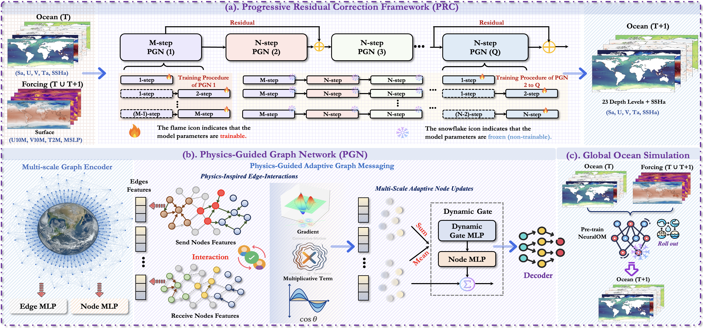
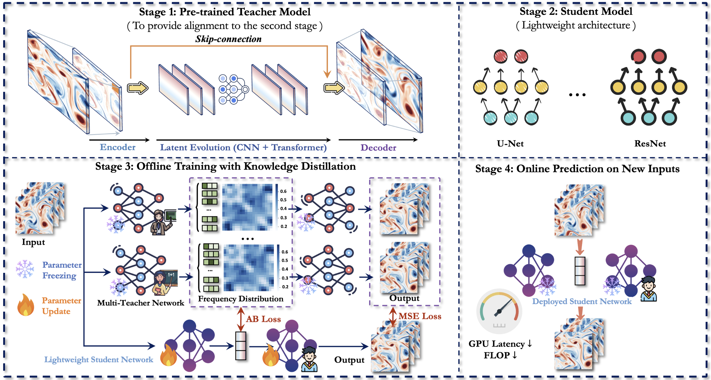








I am about (in year 2026) to return to the Department of Computer Science to pursue a Ph.D. in computer science.

My research journey begins between 2019 and 2022, with a commitment to exploring the deep understanding of natural language. I delve into the evolution from LSTMs to the self-attention mechanism, focusing on the unique challenges of Chinese semantic parsing. During this period, I design and implement [SLFNet](https://arxiv.org/abs/2403.19936), an innovative framework aimed at accurately translating natural language into logical forms. However, the advent of ChatGPT in 2022 completely reshapes the technological paradigm of the NLP field. This disruptive change prompts me to reflect deeply and courageously decide to explore a new and more challenging field.

In 2023, I pivot to video prediction and begin a two-year internship (2023-2025) with the [Tencent Hunyuan Large Model team](https://github.com/easylearningscores/Alexander-wu.github.io/blob/main/images/shixi.pdf). This valuable experience not only allows me to systematically master core models such as ConvLSTM and SimVP but, more importantly, it teaches me how to deeply understand and generate dynamic data from both temporal and spatial dimensions. I am honored to work alongside top researchers in the industry (such as [Xingjian Shi](https://scholar.google.com/citations?user=P4G6H7oAAAAJ&hl=en), [Yuxuan Liang](https://yuxuanliang.com/), [Fan Xu](https://scholar.google.com/citations?hl=en&user=qfMSkBgAAAAJ&view_op=list_works&sortby=pubdate), etc.), and our close collaboration leads to a "blowout period" of academic achievements: as a core author, I publish nearly 20 papers in top conferences such as ICML, ICLR, and NeurIPS. This gives me the freedom and confidence to pursue higher academic goals.

By the end of 2024, I transition the experience accumulated in the deep learning field toward a direction with more fundamental scientific value: using artificial intelligence to accelerate the solving of partial differential equations (PDEs). To overcome the bottleneck of computational efficiency, I propose the [NMO](https://dl.acm.org/doi/abs/10.1145/3637528.3671779) method, which skillfully utilizes manifold learning to optimize the performance of neural networks and explores distillation techniques to achieve faster inference. My ultimate goal is to apply this technology to solve real-world challenges.

Entering 2025, I focus my research on the application of large-scale PDE solving in Earth sciences, particularly in weather and climate modeling. After accumulating experience and through unremitting efforts, including pre-training and fine-tuning on hundreds of cards, I, in collaboration with [Yuan Gao](https://yuangao-yg.github.io/), successfully develop [TritonCast](https://arxiv.org/abs/2505.19432), an advanced AI model for long-term Earth system prediction.

Next, in 2026, I will return to the computer science department to continue my doctoral studies, with my research direction focusing on video generation, and the post-training and application of LLM/Agent/VLM.

**Email**: <u>wuhao2022@mail.ustc.edu.cn</u>  &nbsp; &nbsp;  **Wechat**: How_Alexander_Wu

<h1 id='news'>🔥 News</h1>

  <ul>
    <li><strong>2025.11.08</strong>: 2 papers were accepted to AAAI2026, Main Track, Congrats to All !</li>
    <li><strong>2025.09.18</strong>: 2 papers were accepted to NeurIPS2025, Congrats to All !</li>
    <li><strong>2025.08.01</strong>: I have joined Tencent CSIG as a research intern @ Tencent Jarvis Research Center. </li>
    <li><strong>2025.06.26</strong>: 1 paper was accepted to ICCV2025 (Corresponding Author).</li>
    <li><strong>2025.06.18</strong>: I have graduated from USTC CS, and received the Outstanding Graduation Thesis award, which was given to only 3 people in my graduating class.</li>
    <li><strong>2025.05.01</strong>: 1 paper was accepted to ICML2025, Congrats to Yuan ! (Co-First Author).</li>
    <li><strong>2025.01.22</strong>: 1 paper was accepted to ICLR2025 (Corresponding Author).</li>
    <li><strong>2024.11.16</strong>: 1 paper was accepted to KDD2025 ADS (First Author).</li>
    <li><strong>2024.09.26</strong>: 3 papers were accepted to NeurIPS2024 (First Author and Two co-author).</li>
    <li><strong>2024.07.16</strong>: 1 paper was accepted to ACM MM2024 (First Author).</li>
    <li><strong>2024.05.17</strong>: 1 papers was accepted to KDD2024 (First Author).</li>
    <li><strong>2024.05.01</strong>: 1 paper was accepted to ICML2024 (First Author).</li>
    <li><strong>2024.01.16</strong>: 1 paper was accepted to ICLR2024 (Spotlight) (Co-First Author).</li>
    <li><strong>2024.02.21</strong>: 1 paper was accepted to TKDE2024 (Co-First Author).</li>
    <li><strong>2023.12.09</strong>: 1 paper was accepted to AAAI2024 (First Author).</li>
    <li><strong>2023.09.22</strong>: 1 paper was accepted to NeurIPS2023 (Co-First Author).</li>
    <li><strong>2022.10.09</strong>: National Scholarship, China, 2022 (top 0.1% nation-wide, From USTC).</li>
  </ul>

#  📖 Research Experience

  
  <ul style="list-style-type: disc; padding-left: 20px;">
    <li style="list-style-type: none;">Jarvis Lab, Tencent</li>
    <li style="list-style-type: none;"><em>2025.08 - Present</em>, <strong>Research intern</strong></li>
    <li style="list-style-type: none;">Mentored by <a href="https://scholar.google.com/citations?user=lslB5jkAAAAJ&hl=zh-CN">Xian Wu</a></li>
  </ul>

  
  <ul style="list-style-type: disc; padding-left: 20px;">
    <li style="list-style-type: none;">Machine Learning Platform Department, Large model training group, Tencent</li>
    <li style="list-style-type: none;"><em>2023.08 - 2025.07</em>, <strong>Research intern</strong></li>
    <li style="list-style-type: none;">Mentored by <a href="https://github.com/easylearningscores/Alexander-wu.github.io/blob/main/images/shixi.pdf">Jinbao Xue</a></li>
  </ul>

  
  <ul style="list-style-type: disc; padding-left: 20px;">
    <li style="list-style-type: none;">CityMind Lab, Hong Kong University of Science and Technology (Guangzhou)</li>
    <li style="list-style-type: none;"><em>2023.05 - 2023.08</em>, <strong>Research intern</strong></li>
    <li style="list-style-type: none;">Advisor <a href="http://buaahsh.github.io/">Yuxuan Liang</a></li>
  </ul>

# 📝 Publications 
#### Scientific Machine Learning

- ``ICML2025`` [OneForecast: A Universal Framework for Global and Regional Weather Forecasting]([https://arxiv.org/abs/2502.00338](https://arxiv.org/abs/2502.00338)). Yuan Gao, Hao Wu, Ruiqi Shu, huanshuo dong, Fan Xu, Rui Ray Chen, Yibo Yan, Qingsong Wen, Xuming Hu, Kun Wang, Jiahao Wu, Li Qing, Hui Xiong, Xiaomeng Huang#. ICML, 2025.

- ``NeurIPS2024`` [PURE: Prompt Evolution with Graph ODE for Out-of-distribution Fluid Dynamics Modeling]([https://openreview.net/forum?id=JsPvL6ExK8&referrer=%5BAuthor%20Console%5D(%2Fgroup%3Fid%3DICML.cc%2F2024%2FConference%2FAuthors%23your-submissions](https://openreview.net/forum?id=z86knmjoUq&referrer=%5Bthe%20profile%20of%20Hao%20Wu%5D(%2Fprofile%3Fid%3D~Hao_Wu39)))). **Hao Wu**, Changhu Wang, Fan Xu, Jinbao Xue, Chong Chen, Xian-Sheng Hua, Xiao Luo#. NeurIPS, 2024.

- ``ICML2024`` [Prometheus: Out-of-distribution Fluid Dynamics Modeling with Disentangled Graph ODE](https://openreview.net/forum?id=JsPvL6ExK8&referrer=%5BAuthor%20Console%5D(%2Fgroup%3Fid%3DICML.cc%2F2024%2FConference%2FAuthors%23your-submissions)). **Hao Wu**, Huiyuan Wang, Kun Wang, Weiyan Wang, ChanganYe, Yangyu Tao, Chong Chen, Xian-Sheng Hua, Xiao Luo#. ICML, 2024.

- ``Arxiv`` [Spatio-temporal fluid dynamics modeling via physical-awareness and parameter diffusion guidance](https://scholar.google.com/citations?view_op=view_citation&hl=en&user=HdXMhfcAAAAJ&citation_for_view=HdXMhfcAAAAJ:IWHjjKOFINEC). **Hao Wu**, Fan Xu, Yifan Duan, Ziwei Niu, Weiyan Wang, Gaofeng Lu, Kun Wang, Yuxuan Liang#, Yang Wang#. Arxiv, 2024.

#### Spatio-temporal Prediction
- ``ICCV2025`` [Frequency-Aligned Knowledge Distillation for Lightweight Spatiotemporal Forecasting
](https://openreview.net/forum?id=sKEFrZ0wCj#discussion). Yuqi Li, Chuanguang Yang, Hansheng Zeng, Zeyu Dong, Zhulin An, Yongjun Xu, Yingli Tian, **Hao Wu#**. ICCV, 2025.

- ``KDD2025`` [DynST: Dynamic Sparse Training for Resource-Constrained Spatio-Temporal Forecasting](https://openreview.net/forum?id=sKEFrZ0wCj#discussion). **Hao Wu**, Haomin Wen, Guibin Zhang, Yutong Xia, Yuxuan Liang, Yu Zheng, Qingsong Wen, Kun Wang#. KDD, 2025.

- ``AAAI2024`` [Earthfarseer: versatile spatio-temporal dynamical systems modeling in one model](https://ojs.aaai.org/index.php/AAAI/article/view/29521/30866). **Hao Wu**, Yuxuan Liang, Wei Xiong#, Zhengyang Zhou, Wei Huang, Shilong Wang, Kun Wang#. AAAI, 2024.

- ``ICLR2024`` [NuwaDynamics: Discovering and Updating in Causal Spatio-Temporal Modeling](https://ojs.aaai.org/index.php/AAAI/article/view/29521/30866). **Kun Wang^**, **Hao Wu^**, Yifan Duan, Guibin Zhang, Kai Wang, Xiaojiang Peng, Yu Zheng, Yuxuan Liang#, Yang Wang#. ICLR, 2024.

- ``TKDE2024`` [Modeling spatio-temporal dynamical systems with neural discrete learning and levels-of-experts](https://scholar.google.com/citations?view_op=view_citation&hl=en&user=HdXMhfcAAAAJ&citation_for_view=HdXMhfcAAAAJ:Wp0gIr-vW9MC). **Kun Wang^**, **Hao Wu^**, Guibin Zhang, Junfeng Fang, Yuxuan Liang, Yuankai Wu, Roger Zimmermann, Yang Wang#. TKDE, 2024.

- ``ACM MM2024`` [PastNet: introducing physical inductive biases for spatio-temporal video prediction](https://arxiv.org/abs/2305.11421).**Hao Wu**, Wei Xiong, Fan Xu, Xiao Luo#, Chong Chen, Xian-Sheng Hua, Haixin Wang#. ACM MM, 2024.

- ``Arxiv`` [BeamVQ: Aligning Space-Time Forecasting Model via Self-training on Physics-aware Metrics](https://openreview.net/forum?id=iL6FrLIc8K&referrer=%5BAuthor%20Console%5D(%2Fgroup%3Fid%3DNeurIPS.cc%2F2024%2FConference%2FAuthors%23your-submissions)).**Hao Wu**, Xingjian Shi, Ziyue Huang, Penghao Zhao, Wei Xiong, Jinbao Xue, Yangyu Tao, Xiaomeng Huang, Weiyan Wang #. Arxiv.

#### Neural Operator Learning 

- ``Arxiv`` [Turb-L1: Achieving Long-term Turbulence Tracing By Tackling Spectral Bias](https://arxiv.org/abs/2505.19038). Hao Wu, Yuan Gao, Ruiqi Shu, Zean Han, Fan Xu, Zhihong Zhu, Qingsong Wen, Xian Wu, Kun Wang*, Xiaomeng Huang*.

  
- ``KDD2024`` [Neural Manifold Operators for Learning the Evolution of Physical Dynamics](https://openreview.net/pdf?id=r7n0Q4P66V). **Hao Wu**, Kangyu Weng, Shuyi Zhou, Xiaomeng Huang#, Wei Xiong#. KDD, 2024.

- ``AI4TS(Oral)`` [Neural Manifold Operator for Geophysical Fluid Dynamics Prediction](https://openreview.net/pdf?id=r7n0Q4P66V). Wei Xiong, Kun Wang, Yuxuan Liang, Hao Wu#, Xiaomeng Huang#.  AI for Time Series (AI4TS) Workshop @ AAAI, 2024.

### Information Retrieval

- ``NeurIPS2023`` [IDEA: An Invariant Perspective for Efficient Domain Adaptive Image Retrieval](https://openreview.net/forum?id=77i6itptQW&referrer=%5Bthe%20profile%20of%20Haixin%20Wang%5D(%2Fprofile%3Fid%3D~Haixin_Wang3)). **Haixin Wang^**, **Hao Wu^**, Jinan Sun, Shikun Zhang, Chong Chen, Xian-Sheng Hua, Xiao Luo#. NeurIPS, 2023.

## Selected Publications

---

AAAI 2026

[NeuralOM: Neural Ocean Model for Subseasonal-to-Seasonal Simulation](https://arxiv.org/abs/2505.21020)

Yuan Gao†, **Hao Wu**† ‡ , Fan Xu, Yanfei Xiang, Ruijian Gou,  Ruiqi Shu, Qingsong Wen, Xian Wu, Kun Wang*, Xiaomeng Huang*

*(AAAI2026, CCF Rank A)*  

<a href="https://arxiv.org/abs/2505.21020" target="_blank">Paper</a> | <a href="https://github.com/YuanGao-YG/NeuralOM" target="_blank">Code</a>
 

ICCV 2025

[Frequency-Aligned Knowledge Distillation for Lightweight Spatiotemporal Forecasting](https://openreview.net/group?id=thecvf.com/ICCV/2025/Conference/Authors&referrer=%5BHomepage%5D(%2F))

Yuqi Li, Chuanguang Yang, Hansheng Zeng, Zeyu Dong, Zhulin An, Yongjun Xu, Yingli Tian, **Hao Wu#**

*(ICCV2025, CCF Rank A)*  

<a href="https://arxiv.org/abs/2502.00338" target="_blank">Paper</a> | <a href="https://github.com/itsnotacie/SDKD" target="_blank">Code</a>

ICML 2025

[OneForecast: A Universal Framework for Global and Regional Weather Forecasting](https://openreview.net/forum?id=A23C57icJt&referrer=%5BAuthor%20Console%5D(%2Fgroup%3Fid%3DICLR.cc%2F2025%2FConference%2FAuthors%23your-submissions))

Yuan Gao, Hao Wu, Ruiqi Shu, huanshuo dong, Fan Xu, Rui Ray Chen, Yibo Yan, Qingsong Wen, Xuming Hu, Kun Wang, Jiahao Wu, Li Qing, Hui Xiong, Xiaomeng Huang#

*(ICML2025, CCF Rank A)*  

<a href="https://arxiv.org/abs/2502.00338" target="_blank">Paper</a> | <a href="https://github.com/YuanGao-YG/OneForecast" target="_blank">Code</a>

ICLR 2025

[Open-CK: A Large Multi-Physics Fields Coupling benchmarks in Combustion Kinetics](https://openreview.net/forum?id=A23C57icJt)

Zaige Fei, Fan Xu, Junyuan Mao, Yuxuan Liang, Qingsong Wen, Kun Wang, **Hao Wu#**, Yang Wang

*(ICLR2025, THU Rank A)*  

<a href="https://openreview.net/forum?id=A23C57icJt" target="_blank">Paper</a> | <a href="https://github.com/easylearningscores" target="_blank">Code</a>

KDD 2025

[DynST: Dynamic Sparse Training for Resource-Constrained Spatio-Temporal Forecasting](https://arxiv.org/abs/2403.02914)

**Hao Wu**, Haomin Wen, Guibin Zhang, Yutong Xia, Yuxuan Liang, Yu Zheng, Qingsong Wen, Kun Wang

*(KDD2025, CCF Rank A)*  

<a href="https://arxiv.org/abs/2505.19432" target="_blank">Paper</a> | <a href="https://github.com/easylearningscores" target="_blank">Code</a>

KDD 2024

[Neural Manifold Operators for Learning the Evolution of Physical Dynamics](https://dl.acm.org/doi/abs/10.1145/3637528.3671779)

**Hao Wu**, Kangyu Weng, Shuyi Zhou, Xiaomeng Huang, Wei Xiong

*(KDD2024, CCF Rank A)*  

<a href="https://dl.acm.org/doi/10.1145/3637528.3671779" target="_blank">Paper</a> | <a href="https://github.com/AI4EarthLab/Neural-Manifold-Operators" target="_blank">Code</a>

ICML 2024

[Prometheus: Out-of-distribution Fluid Dynamics Modeling with Disentangled Graph ODE](https://openreview.net/forum?id=JsPvL6ExK8&referrer=%5Bthe%20profile%20of%20Hao%20Wu%5D(%2Fprofile%3Fid%3D~Hao_Wu39))

**Hao Wu**,  Huiyuan Wang, Kun Wang, Weiyan Wang, ChanganYe, Yangyu Tao, Chong Chen, Xian-Sheng Hua, Xiao Luo

*(ICML2024, CCF Rank A)*  
 
<a href="https://proceedings.mlr.press/v235/wu24aa.html" target="_blank">Paper</a> | <a href="https://github.com/easylearningscores/DGODE_ood" target="_blank">Code</a> | <a href="https://huggingface.co/datasets/easylearning/Prometheus/tree/main" target="_blank">Benchmark</a>

ACMMM  2024

[PastNet: Introducing Physical Inductive Biases for Spatio-temporal Video Prediction](https://openreview.net/forum?id=mL0KvSwXzk&referrer=%5Bthe%20profile%20of%20Xian-Sheng%20Hua%5D(%2Fprofile%3Fid%3D~Xian-Sheng_Hua1))

**Hao Wu**, Fan Xu, Chong Chen, Xian-Sheng Hua, Xiao Luo, Haixin Wang

*(ACM MM, CCF Rank A)*  

<a href="https://dl.acm.org/doi/10.1145/3664647.3681489" target="_blank">Paper</a> | <a href="https://github.com/easylearningscores/PastNet" target="_blank">Code</a>

AAAI 2024

[Earthfarsser: Versatile Spatio-Temporal Dynamical Systems Modeling in One Model](https://ojs.aaai.org/index.php/AAAI/article/view/29521)

**Hao Wu**, Yuxuan Liang, Wei Xiong, Zhengyang Zhou, Wei Huang, Shilong Wang, Kun Wang

*(AAAI2024, CCF Rank A)*  

<a href="https://ojs.aaai.org/index.php/AAAI/article/view/29521" target="_blank">Paper</a> | <a href="https://github.com/easylearningscores/EarthFarseer" target="_blank">Code</a>

NeurIPS 2024

[PURE: Prompt Evolution with Graph ODE for Out-of-distribution Fluid Dynamics Modeling](https://easylearningscores.github.io/)

**Hao Wu**, Changhu Wang, Fan Xu, Jinbao Xue, Chong Chen, Xian-Sheng Hua, Xiao Luo 

*(NeurIPS2024, CCF Rank A)*  

<a href="https://neurips.cc/virtual/2024/poster/92971" target="_blank">Paper</a> | <a href="https://github.com/easylearningscores" target="_blank">Code</a>

ICLR 2024

[NuwaDynamics: Discovering and Updating in Causal Spatio-Temporal Modeling](https://easylearningscores.github.io/)

**Kun Wang**, **Hao Wu**, Yifan Duan, Guibin Zhang, Kai Wang, Xiaojiang Peng, Yu Zheng, Yuxuan Liang, Yang Wang

*(ICLR2024, THU Rank A spotlight)*  

<a href="https://openreview.net/forum?id=sLdVl0q68X" target="_blank">Paper</a> | <a href="https://github.com/easylearningscores/NuwaDynamics" target="_blank">Code</a>

---

# 🎖 Honors and Awards

- *2024.09* First-class Academic Scholarship of the University of Science and Technology of China.
- *2022.10* National Scholarship, China (top 0.1% nation-wide).
- *2022.09* First-class Academic Scholarship of the University of Science and Technology of China.

# 💬 Invited Talks

- *2024.03*, Application and Research of GNN in Meteorological Prediction. @ Sun Yat-sen University
- *2023.12*, Earthfarseer: versatile spatio-temporal dynamical systems modeling in one model. @ AI TIME 
- *2023.06*, A Review of Spatio-Temporal Forecasting Models. @ Tsinghua University

# 💻 Academic service

- PC Member/Conference Reviewer:
  NeurIPS2023 Conference Reviewers,  NeurIPS2024 Conference Reviewers,  NeurIPS 2024 Datasets and Benchmarks Track Reviewers, ICLR 2024 Conference Reviewers, ICML 2024 Conference Reviewers, ACMMM 2024 Conference Reviewers,  ICLR2025 Conference Reviewers, NeurIPS 2024 Datasets and Benchmarks Track Reviewers, AISTATS 2025 Conference Reviewers, AAAI 2025 Conference Program Committee,  NeurIPS2025 Conference Reviewers, ACMMM 2025 Conference Reviewers, ICCV 2025 Conference Reviewers, ICML 2025 Conference Reviewers.

# 👨🏻 Miscellaneous

- 🏀 I am a big fan of basketball, i love Kobe Bryant and i like Fadeaway Shot. I also like Curry.
- 👑 I am very interested in history.

    

