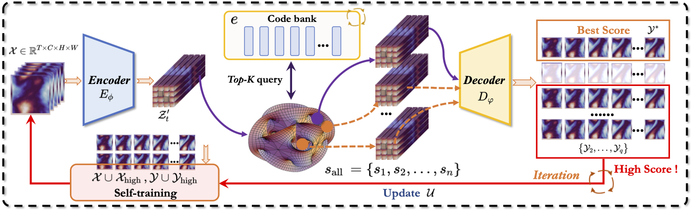








I am Hao Wu, currently a first-year PhD student in the School of Science at [Tsinghua University](https://www.tsinghua.edu.cn/). Previously, I graduated from the Department of Computer Science at the [University of Science and Technology of China (USTC)](https://www.ustc.edu.cn/). During my Master's studies at USTC, I was also a joint training student in the large model training group of the Machine Learning Platform Department at [Tencent](https://www.tencent.com/en-us/). My research interests are as follows:

* **Scientific Machine Learning**: The ultimate goal of Scientific Machine Learning (SciML) is to accelerate scientific discovery and address complex scientific and engineering challenges by fusing domain knowledge with machine learning. It aims to develop more accurate, efficient, and interpretable predictive models, thereby deepening our understanding of the world and driving innovation.

* **Vision-Language Models for Robotics**: The ultimate goal of Vision-Language Models (VLMs) for Robotics is to enable robots to deeply understand and interact with the world by grounding language in visual perception for intelligent action. It aims to build more versatile, collaborative, and general-purpose robots capable of understanding nuanced human instructions and performing complex tasks in real-world environments.

# 🔥 News
- *2025.0501*: &nbsp;🎉🎉 1 paper was accepted to ICML2025, Congrats to Yuan and Ruiqi! (Co-First Author).
- *2025.0122*: &nbsp;🎉🎉 1 paper was accepted to ICLR2025 (Corresponding Author).
- *2024.1116*: &nbsp;🎉🎉 1 paper was accepted to KDD2025 ADS (First Author).
- *2024.0926*: &nbsp;🎉🎉 3 papers were accepted to NeurIPS2024 (First Author and Two co-author).
- *2024.0716*: &nbsp;🎉🎉 1 paper was accepted to ACM MM2024 (First Author).
- *2024.0517*: &nbsp;🎉🎉 1 papers was accepted to KDD2024 (First Author).
- *2024.0501*: &nbsp;🎉🎉 1 paper was accepted to ICML2024 (First Author).
- *2024.0116*: &nbsp;🎉🎉 1 paper was accepted to ICLR2024  (Spotlight) (Co-First Author).
- *2024.0221*: &nbsp;🎉🎉 1 paper was accepted to TKDE2024 (Co-First Author).
- *2023.1209*: &nbsp;🎉🎉 1 paper was accepted to AAAI2024 (First Author).
- *2023.0922*: &nbsp;🎉🎉 1 paper was accepted to NeurIPS2023 (Co-First Author).
- *2022.1009*: &nbsp;🎉🎉 National Scholarship, China, 2022 (top 0.1% nation-wide, From USTC).

#  📖 Research Experience

  
  <ul style="list-style-type: disc; padding-left: 20px;">
    <li style="list-style-type: none;">Machine Learning Platform Department, Large model training group, Tencent</li>
    <li style="list-style-type: none;"><em>2023.08 - 2025.07</em>, <strong>Research intern</strong></li>
    <li style="list-style-type: none;">mentored by <a href="http://buaahsh.github.io/">Jinbao Xue</a></li>
  </ul>

  
  <ul style="list-style-type: disc; padding-left: 20px;">
    <li style="list-style-type: none;">CityMind Lab, Hong Kong University of Science and Technology (Guangzhou)</li>
    <li style="list-style-type: none;"><em>2023.06 - 2024.06</em>, <strong>Research intern</strong></li>
    <li style="list-style-type: none;">Advisor <a href="http://buaahsh.github.io/">Yuxuan Liang</a></li>
  </ul>

# 📝 Publications 
#### Scientific Machine Learning

- ``ICML2025`` [OneForecast: A Universal Framework for Global and Regional Weather Forecasting]([https://arxiv.org/abs/2502.00338](https://arxiv.org/abs/2502.00338)). Yuan Gao, Hao Wu, Ruiqi Shu, huanshuo dong, Fan Xu, Rui Ray Chen, Yibo Yan, Qingsong Wen, Xuming Hu, Kun Wang, Jiahao Wu, Li Qing, Hui Xiong, Xiaomeng Huang#. ICML, 2025.

- ``NeurIPS2024`` [PURE: Prompt Evolution with Graph ODE for Out-of-distribution Fluid Dynamics Modeling]([https://openreview.net/forum?id=JsPvL6ExK8&referrer=%5BAuthor%20Console%5D(%2Fgroup%3Fid%3DICML.cc%2F2024%2FConference%2FAuthors%23your-submissions](https://openreview.net/forum?id=z86knmjoUq&referrer=%5Bthe%20profile%20of%20Hao%20Wu%5D(%2Fprofile%3Fid%3D~Hao_Wu39)))). **Hao Wu**, Changhu Wang, Fan Xu, Jinbao Xue, Chong Chen, Xian-Sheng Hua, Xiao Luo#. NeurIPS, 2024.

- ``ICML2024`` [Prometheus: Out-of-distribution Fluid Dynamics Modeling with Disentangled Graph ODE](https://openreview.net/forum?id=JsPvL6ExK8&referrer=%5BAuthor%20Console%5D(%2Fgroup%3Fid%3DICML.cc%2F2024%2FConference%2FAuthors%23your-submissions)). **Hao Wu**, Huiyuan Wang, Kun Wang, Weiyan Wang, ChanganYe, Yangyu Tao, Chong Chen, Xian-Sheng Hua, Xiao Luo#. ICML, 2024.

- ``Arxiv`` [AI-GOMS: Large AI-Driven Global Ocean Modeling System](https://arxiv.org/abs/2308.03152). Wei Xiong, Yanfei Xiang, **Hao Wu**, Shuyi Zhou, Yuze Sun, Muyuan Ma, Xiaomeng Huang#. Arxiv, 2024.

- ``Arxiv`` [Spatio-temporal fluid dynamics modeling via physical-awareness and parameter diffusion guidance](https://scholar.google.com/citations?view_op=view_citation&hl=en&user=HdXMhfcAAAAJ&citation_for_view=HdXMhfcAAAAJ:IWHjjKOFINEC). **Hao Wu**, Fan Xu, Yifan Duan, Ziwei Niu, Weiyan Wang, Gaofeng Lu, Kun Wang, Yuxuan Liang#, Yang Wang#. Arxiv, 2024.

#### Spatio-temporal Prediction
- ``KDD2025`` [DynST: Dynamic Sparse Training for Resource-Constrained Spatio-Temporal Forecasting](https://openreview.net/forum?id=sKEFrZ0wCj#discussion). **Hao Wu**, Haomin Wen, Guibin Zhang, Yutong Xia, Yuxuan Liang, Yu Zheng, Qingsong Wen, Kun Wang#. KDD, 2025.

- ``AAAI2024`` [Earthfarseer: versatile spatio-temporal dynamical systems modeling in one model](https://ojs.aaai.org/index.php/AAAI/article/view/29521/30866). **Hao Wu**, Yuxuan Liang, Wei Xiong#, Zhengyang Zhou, Wei Huang, Shilong Wang, Kun Wang#. AAAI, 2024.

- ``ICLR2024`` [NuwaDynamics: Discovering and Updating in Causal Spatio-Temporal Modeling](https://ojs.aaai.org/index.php/AAAI/article/view/29521/30866). **Kun Wang^**, **Hao Wu^**, Yifan Duan, Guibin Zhang, Kai Wang, Xiaojiang Peng, Yu Zheng, Yuxuan Liang#, Yang Wang#. ICLR, 2024.

- ``TKDE2024`` [Modeling spatio-temporal dynamical systems with neural discrete learning and levels-of-experts](https://scholar.google.com/citations?view_op=view_citation&hl=en&user=HdXMhfcAAAAJ&citation_for_view=HdXMhfcAAAAJ:Wp0gIr-vW9MC). **Kun Wang^**, **Hao Wu^**, Guibin Zhang, Junfeng Fang, Yuxuan Liang, Yuankai Wu, Roger Zimmermann, Yang Wang#. TKDE, 2024.

- ``ACM MM2024`` [PastNet: introducing physical inductive biases for spatio-temporal video prediction](https://arxiv.org/abs/2305.11421).**Hao Wu**, Wei Xiong, Fan Xu, Xiao Luo#, Chong Chen, Xian-Sheng Hua, Haixin Wang#. ACM MM, 2024.

- ``Arxiv`` [BeamVQ: Aligning Space-Time Forecasting Model via Self-training on Physics-aware Metrics](https://openreview.net/forum?id=iL6FrLIc8K&referrer=%5BAuthor%20Console%5D(%2Fgroup%3Fid%3DNeurIPS.cc%2F2024%2FConference%2FAuthors%23your-submissions)).**Hao Wu**, Xingjian Shi, Ziyue Huang, Penghao Zhao, Wei Xiong, Jinbao Xue, Yangyu Tao, Xiaomeng Huang, Weiyan Wang #. Arxiv.

#### Neural Operator Learning 

- ``KDD2024`` [Neural Manifold Operators for Learning the Evolution of Physical Dynamics](https://openreview.net/pdf?id=r7n0Q4P66V). **Hao Wu**, Kangyu Weng, Shuyi Zhou, Xiaomeng Huang#, Wei Xiong#. KDD, 2024.

- ``AI4TS(Oral)`` [Neural Manifold Operator for Geophysical Fluid Dynamics Prediction](https://openreview.net/pdf?id=r7n0Q4P66V). Wei Xiong, Kun Wang, Yuxuan Liang, Hao Wu#, Xiaomeng Huang#.  AI for Time Series (AI4TS) Workshop @ AAAI, 2024.

### Information Retrieval

- ``NeurIPS2023`` [IDEA: An Invariant Perspective for Efficient Domain Adaptive Image Retrieval](https://openreview.net/forum?id=77i6itptQW&referrer=%5Bthe%20profile%20of%20Haixin%20Wang%5D(%2Fprofile%3Fid%3D~Haixin_Wang3)). **Haixin Wang^**, **Hao Wu^**, Jinan Sun, Shikun Zhang, Chong Chen, Xian-Sheng Hua, Xiao Luo#. NeurIPS, 2023.

## Preprints
---

[Turb-L1: Achieving Long-term Turbulence Tracing By Tackling Spectral Bias](https://arxiv.org/abs/2505.19038)

Hao Wu, Yuan Gao, Ruiqi Shu, Zean Han, Fan Xu, Zhihong Zhu, Qingsong Wen, Xian Wu, Kun Wang*, Xiaomeng Huang*

*Arxiv, 2025*  

*(Arxiv)*  

---

[Advanced long-term earth system forecasting by learning the small-scale nature](https://arxiv.org/abs/2505.19432)

Hao Wu, Yuan Gao, Ruiqi Shu, Kun Wang, Ruijian Gou, Chuhan Wu, Xinliang Liu, Juncai He, Shuhao Cao, Junfeng Fang, Xingjian Shi, Feng Tao, Qi Song, Shengxuan Ji, Yanfei Xiang, Yuze Sun, Jiahao Li, Fan Xu, Huanshuo Dong, Haixin Wang, Fan Zhang, Penghao Zhao, Xian Wu, Qingsong Wen, Deliang Chen, Xiaomeng Huang*

*Arxiv, 2025*  

*(Arxiv)*  

## Selected Publications

---

[OneForecast: A Universal Framework for Global and Regional Weather Forecasting](https://openreview.net/forum?id=A23C57icJt&referrer=%5BAuthor%20Console%5D(%2Fgroup%3Fid%3DICLR.cc%2F2025%2FConference%2FAuthors%23your-submissions))

Yuan Gao, Hao Wu, Ruiqi Shu, huanshuo dong, Fan Xu, Rui Ray Chen, Yibo Yan, Qingsong Wen, Xuming Hu, Kun Wang, Jiahao Wu, Li Qing, Hui Xiong, Xiaomeng Huang#

*ICML, 2025*  

*(CCF A)*  

---

[DynST: Dynamic Sparse Training for Resource-Constrained Spatio-Temporal Forecasting](https://openreview.net/group?id=KDD.org/2025/ADS_Track_August/Authors&referrer=%5BHomepage%5D(%2F))

**Hao Wu**, Haomin Wen, Guibin Zhang, Yutong Xia, Yuxuan Liang, Yu Zheng, Qingsong Wen, Kun Wang

*Knowledge Discovery and Data Mining (KDD), 2025*  

*(CCF Rank A)*  

---

[Neural Manifold Operators for Learning the Evolution of Physical Dynamics](https://dl.acm.org/doi/abs/10.1145/3637528.3671779)

**Hao Wu**, Kangyu Weng, Shuyi Zhou, Xiaomeng Huang, Wei Xiong

*Knowledge Discovery and Data Mining (KDD), 2024*  

*(CCF Rank A)*  

---

[Prometheus: Out-of-distribution Fluid Dynamics Modeling with Disentangled Graph ODE](https://openreview.net/forum?id=JsPvL6ExK8&referrer=%5Bthe%20profile%20of%20Hao%20Wu%5D(%2Fprofile%3Fid%3D~Hao_Wu39))

**Hao Wu**,  Huiyuan Wang, Kun Wang, Weiyan Wang, ChanganYe, Yangyu Tao, Chong Chen, Xian-Sheng Hua, Xiao Luo

*The International Conference on Machine Learning (ICML), 2024*  

*(CCF Rank A)*  

---

[PastNet: Introducing Physical Inductive Biases for Spatio-temporal Video Prediction](https://openreview.net/forum?id=mL0KvSwXzk&referrer=%5Bthe%20profile%20of%20Xian-Sheng%20Hua%5D(%2Fprofile%3Fid%3D~Xian-Sheng_Hua1))

**Hao Wu**, Fan Xu, Chong Chen, Xian-Sheng Hua, Xiao Luo, Haixin Wang

*ACM Multimedia (MM), 2024*  

*(CCF Rank A)*  

---

[Earthfarsser: Versatile Spatio-Temporal Dynamical Systems Modeling in One Model](https://ojs.aaai.org/index.php/AAAI/article/view/29521)

**Hao Wu**, Yuxuan Liang, Wei Xiong, Zhengyang Zhou, Wei Huang, Shilong Wang, Kun Wang

*Association for the Advancement of Artificial Intelligence (AAAI), 2024*  

*(CCF Rank A)*  

---

[PURE: Prompt Evolution with Graph ODE for Out-of-distribution Fluid Dynamics Modeling](https://easylearningscores.github.io/)

**Hao Wu**, Changhu Wang, Fan Xu, Jinbao Xue, Chong Chen, Xian-Sheng Hua, Xiao Luo 

*Conference on Neural Information Processing Systems (NeurIPS), 2024*  

*(CCF Rank A)*  

---

[NuwaDynamics: Discovering and Updating in Causal Spatio-Temporal Modeling](https://easylearningscores.github.io/)

**Kun Wang**, **Hao Wu**, Yifan Duan, Guibin Zhang, Kai Wang, Xiaojiang Peng, Yu Zheng, Yuxuan Liang, Yang Wang

*International Conference on Learning Representations (ICLR), 2024*  

*(THU Rank A spotlight)*  

---

[BeamVQ: Aligning Space-Time Forecasting Model via Self-training on Physics-aware Metrics](https://easylearningscores.github.io/)

**Hao Wu**, Xingjian Shi, Ziyue Huang, Penghao Zhao, Wei Xiong, Jinbao Xue, Yangyu Tao, Xiaomeng Huang, Weiyan Wang 

*Arxiv*  

---

# 🎖 Honors and Awards

- *2024.09* First-class Academic Scholarship of the University of Science and Technology of China.
- *2022.10* National Scholarship, China (top 0.1% nation-wide).
- *2022.09* First-class Academic Scholarship of the University of Science and Technology of China.

# 💬 Invited Talks

- *2024.03*, Application and Research of GNN in Meteorological Prediction. @ Sun Yat-sen University
- *2023.12*, Earthfarseer: versatile spatio-temporal dynamical systems modeling in one model. @ AI TIME 
- *2023.06*, A Review of Spatio-Temporal Forecasting Models. @ Tsinghua University

# 💻 Academic service

- PC Member/Conference Reviewer:
  NeurIPS2023 Conference Reviewers,  NeurIPS2024 Conference Reviewers,  NeurIPS 2024 Datasets and Benchmarks Track Reviewers, ICLR 2024 Conference Reviewers, ICML 2024 Conference Reviewers, ACMMM 2024 Conference Reviewers,  ICLR2025 Conference Reviewers, NeurIPS 2024 Datasets and Benchmarks Track Reviewers, AISTATS 2025 Conference Reviewers, AAAI 2025 Conference Program Committee

# 👨🏻 Miscellaneous

- 🏀 I am a big fan of basketball, i love Kobe Bryant and i like Fadeaway Shot. I also like Curry.
- 👑 I am very interested in history.

    

