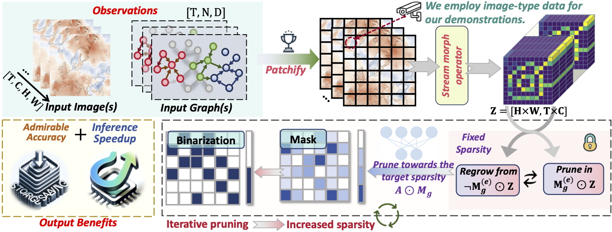








<!-- ================= GLOBAL STYLES ================= -->

<!-- ================= BIO SECTION ================= -->

  
  <!-- 左侧：文字介绍 -->
  

    
Hao Wu

    
Ph.D. Student at Tsinghua University

    
    

      

        My research journey began between 2019 and 2022, focusing on natural language understanding and Chinese semantic parsing. During this time, I designed <a href="https://arxiv.org/abs/2403.19936">SLFNet</a> to translate natural language into logical forms. However, the paradigm shift caused by ChatGPT in 2022 inspired me to pivot toward a new and challenging direction.
      

      

        In 2023, I transitioned to video prediction during a two-year internship at the <a href="https://github.com/Alexander-wu/Alexander-wu.github.io/blob/main/images/shixi.pdf">Tencent Hunyuan Large Model team</a>. This experience allowed me to master spatiotemporal modeling. Working alongside top researchers like <a href="https://scholar.google.com/citations?user=P4G6H7oAAAAJ&hl=en">Xingjian Shi</a>, <a href="https://yuxuanliang.com/">Yuxuan Liang</a>, and <a href="https://scholar.google.com/citations?hl=en&user=qfMSkBgAAAAJ&view_op=list_works&sortby=pubdate">Fan Xu</a>, I co-authored nearly 30 papers in top conferences (ICML, ICLR, NeurIPS), laying a solid foundation for freedom research.
      

      

        By late 2024, I applied my deep learning expertise to AI for Science, specifically accelerating partial differential equation (PDE) solving. I proposed <a href="https://dl.acm.org/doi/abs/10.1145/3637528.3671779">NMO</a> using manifold learning for efficiency and explored distillation techniques (@<a href="https://openaccess.thecvf.com/content/ICCV2025/html/Li_Frequency-Aligned_Knowledge_Distillation_for_Lightweight_Spatiotemporal_Forecasting_ICCV_2025_paper.html">ICCV2025</a>) for faster inference. In 2025, I collaborated with <a href="https://yuangao-yg.github.io/">Yuan Gao</a> to develop <a href="https://arxiv.org/abs/2505.19432">TritonCast</a>, an advanced AI model for long-term Earth system forecasting.
      

      

        In 2026, I will focuse on video generation and the post-training and application of LLMs, Agents, and VLMs.
      

    

    <!-- 链接按钮 -->
    

      <a href="mailto:wuhao2022@mail.ustc.edu.cn" class="link-btn">
        <svg viewBox="0 0 24 24" width="16" height="16" fill="currentColor"><path d="M20 4H4c-1.1 0-1.99.9-1.99 2L2 18c0 1.1.9 2 2 2h16c1.1 0 2-.9 2-2V6c0-1.1-.9-2-2-2zm0 4l-8 5-8-5V6l8 5 8-5v2z"/></svg>
        Email
      </a>
      <a href="https://scholar.google.com/citations?user=HdXMhfcAAAAJ&hl=en" class="link-btn">
         <svg viewBox="0 0 24 24" width="16" height="16" fill="currentColor"><path d="M12 24a7 7 0 1 1 0-14 7 7 0 0 1 0 14zm0-24L0 9.5l4.838 3.94A8 8 0 0 1 12 9a8 8 0 0 1 7.162 4.44L24 9.5z"/></svg>
         Google Scholar
      </a>
      
      <a href="https://github.com/Alexander-wu" class="link-btn">
        <svg height="18" viewBox="0 0 16 16" width="18" style="vertical-align: sub;">
           <path fill-rule="evenodd" d="M8 0C3.58 0 0 3.58 0 8c0 3.54 2.29 6.53 5.47 7.59.4.07.55-.17.55-.38 0-.19-.01-.82-.01-1.49-2.01.37-2.53-.49-2.69-.94-.09-.23-.48-.94-.82-1.13-.28-.15-.68-.52-.01-.53.63-.01 1.08.58 1.23.82.72 1.21 1.87.87 2.33.66.07-.52.28-.87.51-1.07-1.78-.2-3.64-.89-3.64-3.95 0-.87.31-1.59.82-2.15-.08-.2-.36-1.02.08-2.12 0 0 .67-.21 2.2.82.64-.18 1.32-.27 2-.27.68 0 1.36.09 2 .27 1.53-1.04 2.2-.82 2.2-.82.44 1.1.16 1.92.08 2.12.51.56.82 1.27.82 2.15 0 3.07-1.87 3.75-3.65 3.95.29.25.54.73.54 1.48 0 1.07-.01 1.93-.01 2.2 0 .21.15.46.55.38A8.013 8.013 0 0016 8c0-4.42-3.58-8-8-8z"></path>
        </svg>
        GitHub
      </a>
      
      <a href="YOUR_SEMANTIC_SCHOLAR_LINK" class="link-btn">
        <svg viewBox="0 0 24 24" width="16" height="16" fill="currentColor"><path d="M12 2l-5.5 9h11z"/><path d="M12 22l5.5-9h-11z"/></svg>
        Semantic Scholar
      </a>
    

  

  
  <!-- 右侧：头像和邮箱 -->
  
 
    
    <!-- 邮箱地址 -->
    

      <a href="mailto:wuhao2022@mail.ustc.edu.cn" style="color: inherit; text-decoration: none; border-bottom: 1px dotted #999;">
        wuhao2022@mail.ustc.edu.cn
      </a>
    

  

<!-- ================= NEWS SECTION ================= -->
<h1 class="section-title" id='news'>🔥 News</h1>

  

    <ul>
      <li><strong>2025.11.23</strong>: 1 paper was accepted to KDD2026, Main Track (Research), Congratulations to Fan!</li>
      <li><strong>2025.11.08</strong>: 2 papers were accepted to AAAI2026, Main Track, Congratulations to Yuan!</li>
      <li><strong>2025.09.18</strong>: 2 papers were accepted to NeurIPS2025.</li>
      <li><strong>2025.08.01</strong>: I have joined Tencent CSIG as a research intern @ Tencent Jarvis Research Center.</li>
      <li><strong>2025.06.26</strong>: 1 paper was accepted to ICCV2025 (Corresponding Author).</li>
      <li><strong>2025.06.18</strong>: I have graduated from USTC CS, and received the Outstanding Graduation Thesis award.</li>
      <li><strong>2025.05.01</strong>: 1 paper was accepted to ICML2025 (Co-First Author).</li>
      <li><strong>2025.01.22</strong>: 1 paper was accepted to ICLR2025 (Corresponding Author).</li>
      <li><strong>2024.11.16</strong>: 1 paper was accepted to KDD2025 ADS (First Author).</li>
      <li><strong>2024.09.26</strong>: 3 papers were accepted to NeurIPS2024 (First Author and Two co-author).</li>
      <li><strong>2024.07.16</strong>: 1 paper was accepted to ACM MM2024 (First Author).</li>
      <li><strong>2024.05.17</strong>: 1 paper was accepted to KDD2024 (First Author).</li>
      <li><strong>2024.05.01</strong>: 1 paper was accepted to ICML2024 (First Author).</li>
      <li><strong>2024.02.21</strong>: 1 paper was accepted to TKDE2024 (Co-First Author).</li>
      <li><strong>2024.01.16</strong>: 1 paper was accepted to ICLR2024 (Spotlight) (Co-First Author).</li>
      <li><strong>2023.12.09</strong>: 1 paper was accepted to AAAI2024 (First Author).</li>
      <li><strong>2023.09.22</strong>: 1 paper was accepted to NeurIPS2023 (Co-First Author).</li>
      <li><strong>2022.10.09</strong>: National Scholarship, China, 2022 (top 0.1% nation-wide, From USTC).</li>
    </ul>
  

<!-- ================= EXPERIENCE ================= -->
<h1 class="section-title">💼 Research Experience</h1>

  

    
    

      
Jarvis Lab, Tencent

      
Research Intern &nbsp; | &nbsp; Mentor: <a href="#">Xian Wu</a>

      
Aug. 2025 - Present

    

  

  

    
    

      
Machine Learning Platform Dept., Tencent

      
Research Intern (Hunyuan Large Model) &nbsp; | &nbsp; Mentor: <a href="#">Jinbao Xue</a>

      
Aug. 2023 - Jul. 2025

    

  

  

    
    

      
CityMind Lab, HKUST (Guangzhou)

      
Research Intern &nbsp; | &nbsp; Advisor: <a href="#">Yuxuan Liang</a>

      
May 2023 - Aug. 2023

    

  

<!-- ================= PRE-PRINT ================= -->
<h1 class="section-title">🌟 Pre-prints</h1>

  

    
Arxiv 2026

    
  

  

    

      <a href="https://tritoncast4earth.netlify.app/">Advanced Long-term Earth System Forecasting</a>
    

    

      Hao Wu, Yuan Gao, Ruijian Gou, Xian Wu, Chuhan Wu, Huahui Yi, Johannes Brandstetter, Fan Xu, Niklas Boers, Kun Wang, Penghao Zhao, Hao Jia, Qi Song, Xinliang Liu, Juncai He, Shuhao Cao, Huanshuo Dong, Yanfei Xiang, Fan Zhang, Haixin Wang, Xingjian Shi, Qiufeng Wang, Shuaipeng Li, Ruobing Xie, Feng Tao, Yuxu Lu, Yu Guo, Yuntian Chen, Yuxuan Liang, Qingsong Wen, Wanli Ouyang, Deliang Chen, Xiaomeng Huang
    

    

      (Submit to Journal)
    

    

      <a href="https://arxiv.org/abs/2505.19432">Paper</a>
      <a href="https://github.com/Alexander-wu/TritonCast">Code</a>
      <a href="https://huggingface.co/TritonCast">Hugging Face</a>
      <a href="https://tritoncast4earth.netlify.app/">Project Page</a>
    

  

<!-- ================= SELECTED PUBLICATIONS ================= -->
<h1 class="section-title">🌟 Selected Publications</h1>

<!-- 1. HiGO -->

  

    
KDD 2026

    
  

  

    

      <a href="https://arxiv.org/abs/2505.21020">Advanced Global Wildfire Activity Modeling with Hierarchical Graph ODE</a>
    

    

      Fan Xu, Wei Gong, Hao Wu, Lilan Peng, Nan Wang, Qingsong Wen, Xian Wu, Kun Wang, Xibin Zhao
    

    

      (KDD 2026, CCF Rank A)
    

    

      <a href="https://arxiv.org/abs/">Paper</a>
      <a href="https://github.com/">Code</a>
    

  

  

    
NeurIPS 2025

    
  

  

    

      <a href="https://arxiv.org/abs/2509.17955">Breaking the Discretization Barrier of Continuous Physics Simulation Learning</a>
    

    

      Fan Xu, Hao Wu, Nan Wang, Lilan Peng, Kun Wang, Wei Gong, Xibin Zhao
    

    

      (NeurIPS 2025, CCF Rank A)
    

    

      <a href="https://arxiv.org/abs/2509.17955">Paper</a>
      <a href="#">Code</a>
    

  

<!-- 1. NeuralOM -->

  

    
AAAI 2026

    
  

  

    

      <a href="https://arxiv.org/abs/2505.21020">NeuralOM: Neural Ocean Model for Subseasonal-to-Seasonal Simulation</a>
    

    

      Yuan Gao†, <strong>Hao Wu</strong>†‡, Fan Xu, Yanfei Xiang, Ruijian Gou, Ruiqi Shu, Qingsong Wen, Xian Wu, Kun Wang*, Xiaomeng Huang*
    

    

      (AAAI 2026, CCF Rank A)
    

    

      <a href="https://arxiv.org/abs/2505.21020">Paper</a>
      <a href="https://github.com/YuanGao-YG/NeuralOM">Code</a>
      
    

  

<!-- 2. ICCV 2025 -->

  

    
ICCV 2025

    
  

  

    

      <a href="https://openaccess.thecvf.com/content/ICCV2025/html/Li_Frequency-Aligned_Knowledge_Distillation_for_Lightweight_Spatiotemporal_Forecasting_ICCV_2025_paper.html">Frequency-Aligned Knowledge Distillation for Lightweight Spatiotemporal Forecasting</a>
    

    

      Yuqi Li, Chuanguang Yang, Hansheng Zeng, Zeyu Dong, Zhulin An, Yongjun Xu, Yingli Tian, <strong>Hao Wu#</strong>
    

    

      (ICCV 2025, CCF Rank A)
    

    

      <a href="#">Paper</a>
      <a href="https://github.com/itsnotacie/SDKD">Code</a>
    

  

<!-- 3. OneForecast -->

  

    
ICML 2025

    
  

  

    

      <a href="https://arxiv.org/abs/2502.00338">OneForecast: A Universal Framework for Global and Regional Weather Forecasting</a>
    

    

      Yuan Gao, <strong>Hao Wu</strong>, Ruiqi Shu, Huanshuo Dong, Fan Xu, Rui Ray Chen, Yibo Yan, Qingsong Wen, Xuming Hu, Kun Wang, Jiahao Wu, Li Qing, Hui Xiong, Xiaomeng Huang#
    

    

      (ICML 2025, CCF Rank A)
    

    

      <a href="https://arxiv.org/abs/2502.00338">Paper</a>
      <a href="https://github.com/YuanGao-YG/OneForecast">Code</a>
    

  

<!-- 4. Open-CK -->

  

    
ICLR 2025

    
  

  

    

      <a href="https://openreview.net/forum?id=A23C57icJt">Open-CK: A Large Multi-Physics Fields Coupling benchmarks in Combustion Kinetics</a>
    

    

      Zaige Fei, Fan Xu, Junyuan Mao, Yuxuan Liang, Qingsong Wen, Kun Wang, <strong>Hao Wu#</strong>, Yang Wang
    

    

      (ICLR 2025, THU Rank A)
    

    

      <a href="https://openreview.net/forum?id=A23C57icJt">Paper</a>
      <a href="https://github.com/easylearningscores">Code</a>
    

  

<!-- 5. DynST -->

  

    
KDD 2025

    
  

  

    

      <a href="https://arxiv.org/abs/2403.02914">DynST: Dynamic Sparse Training for Resource-Constrained Spatio-Temporal Forecasting</a>
    

    

      <strong>Hao Wu</strong>, Haomin Wen, Guibin Zhang, Yutong Xia, Yuxuan Liang, Yu Zheng, Qingsong Wen, Kun Wang
    

    

      (KDD 2025, CCF Rank A)
    

    

      <a href="https://arxiv.org/abs/2505.19432">Paper</a>
      <a href="https://github.com/easylearningscores">Code</a>
    

  

<!-- 6. NMO -->

  

    
KDD 2024

    
  

  

    

      <a href="https://dl.acm.org/doi/abs/10.1145/3637528.3671779">Neural Manifold Operators for Learning the Evolution of Physical Dynamics</a>
    

    

      <strong>Hao Wu</strong>, Kangyu Weng, Shuyi Zhou, Xiaomeng Huang, Wei Xiong
    

    

      (KDD 2024, CCF Rank A)
    

    

      <a href="https://dl.acm.org/doi/10.1145/3637528.3671779">Paper</a>
      <a href="https://github.com/AI4EarthLab/Neural-Manifold-Operators">Code</a>
    

  

<!-- 7. Prometheus -->

  

    
ICML 2024

    
  

  

    

      <a href="https://openreview.net/forum?id=JsPvL6ExK8">Prometheus: Out-of-distribution Fluid Dynamics Modeling with Disentangled Graph ODE</a>
    

    

      <strong>Hao Wu</strong>, Huiyuan Wang, Kun Wang, Weiyan Wang, ChanganYe, Yangyu Tao, Chong Chen, Xian-Sheng Hua, Xiao Luo
    

    

      (ICML 2024, CCF Rank A)
    

    

      <a href="https://proceedings.mlr.press/v235/wu24aa.html">Paper</a>
      <a href="https://github.com/easylearningscores/DGODE_ood">Code</a>
      <a href="https://huggingface.co/datasets/easylearning/Prometheus/tree/main">Benchmark</a>
    

  

<!-- 8. PastNet -->

  

    
ACM MM 2024

    
  

  

    

      <a href="https://openreview.net/forum?id=mL0KvSwXzk">PastNet: Introducing Physical Inductive Biases for Spatio-temporal Video Prediction</a>
    

    

      <strong>Hao Wu</strong>, Fan Xu, Chong Chen, Xian-Sheng Hua, Xiao Luo, Haixin Wang
    

    

      (ACM MM 2024, CCF Rank A)
    

    

      <a href="https://dl.acm.org/doi/10.1145/3664647.3681489">Paper</a>
      <a href="https://github.com/easylearningscores/PastNet">Code</a>
    

  

<!-- 9. Earthfarseer -->

  

    
AAAI 2024

    
  

  

    

      <a href="https://ojs.aaai.org/index.php/AAAI/article/view/29521">Earthfarseer: Versatile Spatio-Temporal Dynamical Systems Modeling in One Model</a>
    

    

      <strong>Hao Wu</strong>, Yuxuan Liang, Wei Xiong, Zhengyang Zhou, Wei Huang, Shilong Wang, Kun Wang
    

    

      (AAAI 2024, CCF Rank A)
    

    

      <a href="https://ojs.aaai.org/index.php/AAAI/article/view/29521">Paper</a>
      <a href="https://github.com/easylearningscores/EarthFarseer">Code</a>
    

  

<!-- 10. PURE -->

  

    
NeurIPS 2024

    
  

  

    

      <a href="https://neurips.cc/virtual/2024/poster/92971">PURE: Prompt Evolution with Graph ODE for Out-of-distribution Fluid Dynamics Modeling</a>
    

    

      <strong>Hao Wu</strong>, Changhu Wang, Fan Xu, Jinbao Xue, Chong Chen, Xian-Sheng Hua, Xiao Luo
    

    

      (NeurIPS 2024, CCF Rank A)
    

    

      <a href="https://neurips.cc/virtual/2024/poster/92971">Paper</a>
      <a href="https://github.com/easylearningscores">Code</a>
    

  

<!-- 11. NuwaDynamics -->

  

    
ICLR 2024

    
  

  

    

      <a href="https://openreview.net/forum?id=sLdVl0q68X">NuwaDynamics: Discovering and Updating in Causal Spatio-Temporal Modeling</a>
    

    

      <strong>Kun Wang</strong>, <strong>Hao Wu</strong>, Yifan Duan, Guibin Zhang, Kai Wang, Xiaojiang Peng, Yu Zheng, Yuxuan Liang, Yang Wang
    

    

      (ICLR 2024, THU Rank A Spotlight)
    

    

      <a href="https://openreview.net/forum?id=sLdVl0q68X">Paper</a>
      <a href="https://github.com/easylearningscores/NuwaDynamics">Code</a>
    

  

<!-- ================= MISC ================= -->
<h1 class="section-title">💬 Invited Talks</h1>

  <ul style="line-height: 1.6; padding-left: 20px;">
    <li><em>2024.03</em>, Application and Research of GNN in Meteorological Prediction. @ Sun Yat-sen University</li>
    <li><em>2023.12</em>, Earthfarseer: versatile spatio-temporal dynamical systems modeling in one model. @ AI TIME </li>
  </ul>

<h1 class="section-title">💻 Academic Service</h1>

  <strong>Conference Reviewer / PC Member:</strong> 
  NeurIPS (2023-2025), ICLR (2024-2025), ICML (2024-2025), CVPR (2025), ICCV (2025), AAAI (2025), ACM MM (2024-2025), AISTATS (2025).

<h1 class="section-title">👨🏻 Miscellaneous</h1>

  <ul style="line-height: 1.6; padding-left: 20px;">
    <li>🏀 Big fan of basketball. I love Kobe Bryant and his Fadeaway Shot. Also a fan of Stephen Curry.</li>
    <li>👑 Deeply interested in History.</li>
  </ul>

