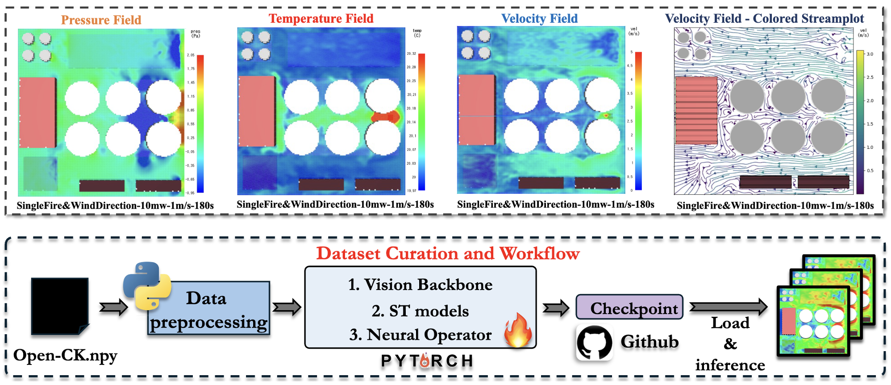








<!-- ================= GLOBAL STYLES ================= -->

<!-- ================= BIO SECTION ================= -->

  

    <strong>Hi, I am Hao Wu.</strong> My research journey begins between 2019 and 2022, focusing on Chinese semantic parsing. During this period, I designed <a href="https://arxiv.org/abs/2403.19936">SLFNet</a> for translating natural language into logical forms. The advent of ChatGPT in 2022 prompted me to explore more challenging fields.
  

  

    In 2023, I pivoted to video prediction, interning at the <a href="#">Tencent Hunyuan Large Model team</a> (2023-2025). I mastered models like ConvLSTM/SimVP and published nearly 30 papers in <strong>ICML, ICLR, and NeurIPS</strong> with top researchers.
  

  

    Currently, I focus on <strong>AI for Earth Sciences (AI4Science)</strong>. I proposed the <a href="#">NMO</a> method and explored distillation techniques (ICCV2025). Recently, I co-developed <a href="https://arxiv.org/abs/2505.19432">TritonCast</a>, an advanced AI model for Earth system forecasting. In 2026, I will continue my Ph.D. studies focusing on video generation and LLM/Agent applications.
  

<!-- ================= BUTTON GRID ================= -->

  <a href="mailto:wuhao2022@mail.ustc.edu.cn" class="link-btn">
    ✉️ Email
  </a>
  <a href="YOUR_GOOGLE_SCHOLAR_LINK" class="link-btn">
    🎓 Google Scholar
  </a>
  <a href="YOUR_GITHUB_LINK" class="link-btn">
    🐙 GitHub
  </a>
  <a href="YOUR_SEMANTIC_SCHOLAR_LINK" class="link-btn">
    📚 Semantic Scholar
  </a>

<!-- ================= NEWS SECTION ================= -->
<h1 class="section-title" id='news'>🔥 News</h1>

  <ul>
    <li><strong>2025.11.08</strong>: 2 papers accepted to AAAI2026 Main Track.</li>
    <li><strong>2025.09.18</strong>: 2 papers accepted to NeurIPS2025.</li>
    <li><strong>2025.08.01</strong>: Joined Tencent CSIG (Jarvis Lab) as a research intern.</li>
    <li><strong>2025.06.26</strong>: 1 paper accepted to ICCV2025 (Corresponding Author).</li>
    <li><strong>2025.06.18</strong>: Graduated from USTC CS with Outstanding Graduation Thesis Award.</li>
    <li><strong>2025.05.01</strong>: 1 paper accepted to ICML2025 (Co-First Author).</li>
    <li><strong>2025.01.22</strong>: 1 paper accepted to ICLR2025 (Corresponding Author).</li>
    <li><strong>2024.11.16</strong>: 1 paper accepted to KDD2025 ADS (First Author).</li>
    <li><strong>2024.01.16</strong>: 1 paper accepted to ICLR2024 (Spotlight).</li>
    <li><strong>2022.10.09</strong>: Received National Scholarship (Top 0.1%).</li>
  </ul>

<!-- ================= EXPERIENCE ================= -->
<h1 class="section-title">💼 Research Experience</h1>

  

    
    

      
Jarvis Lab, Tencent

      
Research Intern &nbsp; | &nbsp; Mentor: <a href="#">Xian Wu</a>

      
Aug. 2025 - Present

    

  

  

    
    

      
Machine Learning Platform Dept., Tencent

      
Research Intern (Hunyuan Large Model) &nbsp; | &nbsp; Mentor: <a href="#">Jinbao Xue</a>

      
Aug. 2023 - Jul. 2025

    

  

  

    
    

      
CityMind Lab, HKUST (Guangzhou)

      
Research Intern &nbsp; | &nbsp; Advisor: <a href="#">Yuxuan Liang</a>

      
May 2023 - Aug. 2023

    

  

<!-- ================= SELECTED PUBLICATIONS ================= -->
<h1 class="section-title">🌟 Selected Publications</h1>

<!-- 1. NeuralOM -->

  

    
AAAI 2026

    
  

  

    

      <a href="https://arxiv.org/abs/2505.21020">NeuralOM: Neural Ocean Model for Subseasonal-to-Seasonal Simulation</a>
    

    

      Yuan Gao†, <strong>Hao Wu</strong>†‡, Fan Xu, Yanfei Xiang, Ruijian Gou, Ruiqi Shu, Qingsong Wen, Xian Wu, Kun Wang*, Xiaomeng Huang*
    

    

      (AAAI 2026, CCF Rank A)
    

    

      <a href="https://arxiv.org/abs/2505.21020">Paper</a>
      <a href="https://github.com/YuanGao-YG/NeuralOM">Code</a>
      
    

  

<!-- 2. ICCV 2025 -->

  

    
ICCV 2025

    
  

  

    

      <a href="#">Frequency-Aligned Knowledge Distillation for Lightweight Spatiotemporal Forecasting</a>
    

    

      Yuqi Li, Chuanguang Yang, Hansheng Zeng, Zeyu Dong, Zhulin An, Yongjun Xu, Yingli Tian, <strong>Hao Wu#</strong>
    

    

      (ICCV 2025, CCF Rank A)
    

    

      <a href="#">Paper</a>
      <a href="https://github.com/itsnotacie/SDKD">Code</a>
    

  

<!-- 3. OneForecast -->

  

    
ICML 2025

    
  

  

    

      <a href="https://arxiv.org/abs/2502.00338">OneForecast: A Universal Framework for Global and Regional Weather Forecasting</a>
    

    

      Yuan Gao, <strong>Hao Wu</strong>, Ruiqi Shu, Huanshuo Dong, Fan Xu, Rui Ray Chen, Yibo Yan, Qingsong Wen, Xuming Hu, Kun Wang, Jiahao Wu, Li Qing, Hui Xiong, Xiaomeng Huang#
    

    

      (ICML 2025, CCF Rank A)
    

    

      <a href="https://arxiv.org/abs/2502.00338">Paper</a>
      <a href="https://github.com/YuanGao-YG/OneForecast">Code</a>
    

  

<!-- 4. Open-CK -->

  

    
ICLR 2025

    
  

  

    

      <a href="https://openreview.net/forum?id=A23C57icJt">Open-CK: A Large Multi-Physics Fields Coupling benchmarks in Combustion Kinetics</a>
    

    

      Zaige Fei, Fan Xu, Junyuan Mao, Yuxuan Liang, Qingsong Wen, Kun Wang, <strong>Hao Wu#</strong>, Yang Wang
    

    

      (ICLR 2025, THU Rank A)
    

    

      <a href="https://openreview.net/forum?id=A23C57icJt">Paper</a>
      <a href="https://github.com/easylearningscores">Code</a>
    

  

<!-- 5. DynST -->

  

    
KDD 2025

    
  

  

    

      <a href="https://arxiv.org/abs/2403.02914">DynST: Dynamic Sparse Training for Resource-Constrained Spatio-Temporal Forecasting</a>
    

    

      <strong>Hao Wu</strong>, Haomin Wen, Guibin Zhang, Yutong Xia, Yuxuan Liang, Yu Zheng, Qingsong Wen, Kun Wang
    

    

      (KDD 2025, CCF Rank A)
    

    

      <a href="https://arxiv.org/abs/2505.19432">Paper</a>
      <a href="https://github.com/easylearningscores">Code</a>
    

  

<!-- 6. NMO -->

  

    
KDD 2024

    
  

  

    

      <a href="https://dl.acm.org/doi/abs/10.1145/3637528.3671779">Neural Manifold Operators for Learning the Evolution of Physical Dynamics</a>
    

    

      <strong>Hao Wu</strong>, Kangyu Weng, Shuyi Zhou, Xiaomeng Huang, Wei Xiong
    

    

      (KDD 2024, CCF Rank A)
    

    

      <a href="https://dl.acm.org/doi/10.1145/3637528.3671779">Paper</a>
      <a href="https://github.com/AI4EarthLab/Neural-Manifold-Operators">Code</a>
    

  

<!-- 7. Prometheus -->

  

    
ICML 2024

    
  

  

    

      <a href="https://openreview.net/forum?id=JsPvL6ExK8">Prometheus: Out-of-distribution Fluid Dynamics Modeling with Disentangled Graph ODE</a>
    

    

      <strong>Hao Wu</strong>, Huiyuan Wang, Kun Wang, Weiyan Wang, ChanganYe, Yangyu Tao, Chong Chen, Xian-Sheng Hua, Xiao Luo
    

    

      (ICML 2024, CCF Rank A)
    

    

      <a href="https://proceedings.mlr.press/v235/wu24aa.html">Paper</a>
      <a href="https://github.com/easylearningscores/DGODE_ood">Code</a>
      <a href="https://huggingface.co/datasets/easylearning/Prometheus/tree/main">Benchmark</a>
    

  

<!-- 8. PastNet -->

  

    
ACM MM 2024

    
  

  

    

      <a href="https://openreview.net/forum?id=mL0KvSwXzk">PastNet: Introducing Physical Inductive Biases for Spatio-temporal Video Prediction</a>
    

    

      <strong>Hao Wu</strong>, Fan Xu, Chong Chen, Xian-Sheng Hua, Xiao Luo, Haixin Wang
    

    

      (ACM MM 2024, CCF Rank A)
    

    

      <a href="https://dl.acm.org/doi/10.1145/3664647.3681489">Paper</a>
      <a href="https://github.com/easylearningscores/PastNet">Code</a>
    

  

<!-- 9. Earthfarseer -->

  

    
AAAI 2024

    
  

  

    

      <a href="https://ojs.aaai.org/index.php/AAAI/article/view/29521">Earthfarseer: Versatile Spatio-Temporal Dynamical Systems Modeling in One Model</a>
    

    

      <strong>Hao Wu</strong>, Yuxuan Liang, Wei Xiong, Zhengyang Zhou, Wei Huang, Shilong Wang, Kun Wang
    

    

      (AAAI 2024, CCF Rank A)
    

    

      <a href="https://ojs.aaai.org/index.php/AAAI/article/view/29521">Paper</a>
      <a href="https://github.com/easylearningscores/EarthFarseer">Code</a>
    

  

<!-- 10. PURE -->

  

    
NeurIPS 2024

    
  

  

    

      <a href="https://neurips.cc/virtual/2024/poster/92971">PURE: Prompt Evolution with Graph ODE for Out-of-distribution Fluid Dynamics Modeling</a>
    

    

      <strong>Hao Wu</strong>, Changhu Wang, Fan Xu, Jinbao Xue, Chong Chen, Xian-Sheng Hua, Xiao Luo
    

    

      (NeurIPS 2024, CCF Rank A)
    

    

      <a href="https://neurips.cc/virtual/2024/poster/92971">Paper</a>
      <a href="https://github.com/easylearningscores">Code</a>
    

  

<!-- 11. NuwaDynamics -->

  

    
ICLR 2024

    
  

  

    

      <a href="https://openreview.net/forum?id=sLdVl0q68X">NuwaDynamics: Discovering and Updating in Causal Spatio-Temporal Modeling</a>
    

    

      <strong>Kun Wang</strong>, <strong>Hao Wu</strong>, Yifan Duan, Guibin Zhang, Kai Wang, Xiaojiang Peng, Yu Zheng, Yuxuan Liang, Yang Wang
    

    

      (ICLR 2024, THU Rank A Spotlight)
    

    

      <a href="https://openreview.net/forum?id=sLdVl0q68X">Paper</a>
      <a href="https://github.com/easylearningscores/NuwaDynamics">Code</a>
    

  

<!-- ================= MISC ================= -->
<h1 class="section-title">💬 Invited Talks</h1>
<ul style="line-height: 1.6; font-size: 16px;">
  <li><em>2024.03</em>, Application and Research of GNN in Meteorological Prediction. @ Sun Yat-sen University</li>
  <li><em>2023.12</em>, Earthfarseer: versatile spatio-temporal dynamical systems modeling in one model. @ AI TIME </li>
</ul>

<h1 class="section-title">💻 Academic Service</h1>

  <strong>Conference Reviewer / PC Member:</strong> 
  NeurIPS (2023-2025), ICLR (2024-2025), ICML (2024-2025), CVPR (2025), ICCV (2025), AAAI (2025), ACM MM (2024-2025), AISTATS (2025).

<h1 class="section-title">👨🏻 Miscellaneous</h1>
<ul style="line-height: 1.6; font-size: 16px;">
  <li>🏀 Big fan of basketball. I love Kobe Bryant and his Fadeaway Shot. Also a fan of Stephen Curry.</li>
  <li>👑 Deeply interested in History.</li>
</ul>
